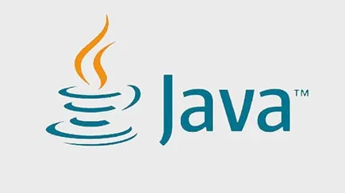
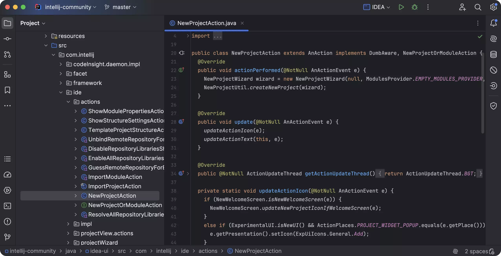
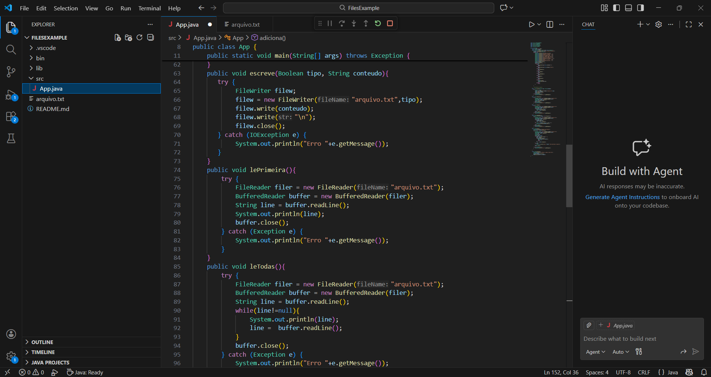
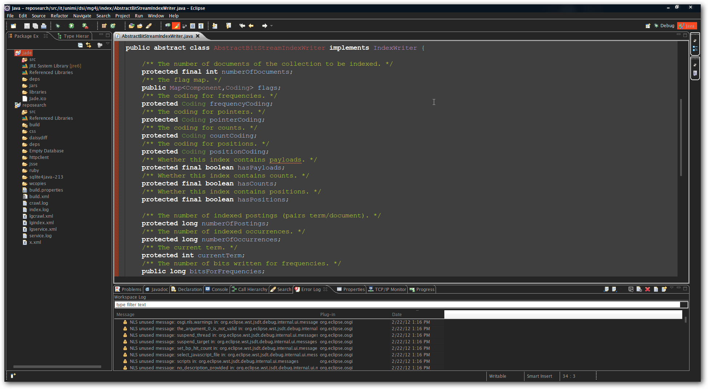

# ☕ Entregável Java: Fundamentos, Ferramentas e Mercado

> 


## 📜 Parte 1 - História e Evolução do Java

| Atributo | Detalhes |
| :--- | :--- |
| **Ano de Criação** | Criada em 1991 (Project Green) e publicada oficialmente em 1995. |
| **Criadores** | James Gosling, Mike Sheridan e Patrick Naughton. |
| **Empresa Responsável** | **Sun Microsystems** (antes de 2010) → **Oracle** (após 2010). |

> 

### 🎯 Objetivo Principal e Impacto
O Java foi concebido com o lema *"Write Once, Run Anywhere"* (Escreva uma vez, execute em qualquer lugar). Seu foco inicial era a **portabilidade** e **segurança** em dispositivos eletrônicos e redes. 

**Impacto na Programação Moderna:**
- Base para sistemas corporativos robustos.
- Fundamental no ecossistema **Android**.
- Referência em **Big Data** e aplicações em nuvem (**Cloud Native**).

### 🚀 Principais Versões e Mudanças
- **Java 8:** Introdução de Lambdas e Streams.
- **Java 11:** Ciclo de suporte de longo prazo (LTS) e melhorias na API HTTP.
- **Java 17:** Atualizações em Records, Sealed Classes e performance.
- **Java 21:** Introdução de Virtual Threads (Projeto Loom), otimizando a concorrência.

---

## 🛠️ Parte 2 - Ambientes de Desenvolvimento (IDEs)

### Comparativo de Ferramentas

| IDE | Vantagens | Desvantagens | Site Oficial |
| :--- | :--- | :--- | :--- |
| **IntelliJ IDEA** | Refatoração inteligente, análise de código superior e excelente integração. | Versão completa é paga e consome bastante RAM. | [jetbrains.com](https://www.jetbrains.com/idea/) |
| **VSCode** | Extremamente leve, modular e possui vasta biblioteca de extensões. | Requer configuração manual para projetos Java complexos. | [code.visualstudio.com](https://code.visualstudio.com/) |
| **Eclipse** | Gratuito, código aberto e muito tradicional no mercado. | Interface datada e pode ser instável em projetos muito grandes. | [eclipse.org](https://www.eclipse.org/) |
 
#### 📸 Capturas de Tela

> **Interface do Intellij** 
>
> 
> **Interface do VSCode** 
>
>  
> **Interface do Eclipse** 

### 🥇 Escolha para Estudo
**Opção:** IntelliJ IDEA.

**Justificativa:** É considerada a IDE mais completa e produtiva para o ecossistema Java moderno. Seus recursos de auto-complete e sugestões de correção facilitam o aprendizado de boas práticas.

---


## 🧩 Parte 3 - Paradigma de Programação (POO)

### Conceitos pilares da POO

---

## Classe

| Conceito | Detalhes                                                                                              |
| -------- | ----------------------------------------------------------------------------------------------------- |
| Classe   | É uma “planta baixa” de algo, ou um molde que define atributos e comportamentos que os objetos terão. |

```java
class Pessoa {
    int idade;
    String nome;
}
```

---

## Objeto

| Conceito | Detalhes                                                                                          |
| -------- | ------------------------------------------------------------------------------------------------- |
| Objeto   | É a instância de uma classe, ou seja, quando criamos um elemento real baseado no molde da classe. |

```java
Pessoa p = new Pessoa();
p.nome = "João";
p.idade = 20;
```

---

## Encapsulamento

| Conceito       | Detalhes                                                                                                                                                             |
| -------------- | -------------------------------------------------------------------------------------------------------------------------------------------------------------------- |
| Encapsulamento | É o conceito de proteger os dados de um objeto, restringindo o acesso direto a eles (usando `private`) e permitindo acesso controlado por meio de getters e setters. |

```java
class Pessoa {
    private String nome;

    public String getNome() {
        return nome;
    }

    public void setNome(String nome) {
        this.nome = nome;
    }
}
```

---

## Herança

| Conceito | Detalhes                                                                                                            |
| -------- | ------------------------------------------------------------------------------------------------------------------- |
| Herança  | É a capacidade de uma classe filha herdar atributos e métodos de uma classe mãe, promovendo reutilização de código. |

```java
class Animal {
    void fazerSom() {
        System.out.println("Som genérico");
    }
}

class Cachorro extends Animal {
}
```

---

## Polimorfismo

| Conceito     | Detalhes                                                                                                           |
| ------------ | ------------------------------------------------------------------------------------------------------------------ |
| Polimorfismo | É a capacidade de um mesmo método ter comportamentos diferentes dependendo do contexto ou da classe que o utiliza. |

```java
class Animal {
    void fazerSom() {
        System.out.println("Som genérico");
    }
}

class Gato extends Animal {
    @Override
    void fazerSom() {
        System.out.println("Miau");
    }
}
```


## 👨‍🎓 Parte 4 - Mercado de trabalho para desenvolvedores Java

**💸 Salário médio de um desenvolvedor Java no Brasil**

| Cargo | CLT | PJ |
| :--- | :--- | :--- |
| **Júnior** | 2k - 6k | 5k - 8,5k |
| **Pleno** | 7k - 11k | 11k - 16k |
| **Sênior** | 12k - 18k | 17k - 28k |

## 🔎 Onde encontrar Java?

| Área | Exemplo  | Por que Java? |
| :--- | :--- | :--- |
| **Finanças** | Apps de investimento e bancos | Seguraça e confiabilidade |
| **Streaming** | Catálogo da Netflix | Alta escalabilidade |
| **Big Data** | Processamento de buscas | Performance com grandes dados |
| **Mobile** | Apps de delivery antigos/robustos | Compatibilidade android |
| **Internet of Things** | Sensores industriais | Portabilidade entre hardwares |

## ⚙ Tecnologia / Frameworks exigidos para Java

**Spring Boot:**
- Criado para simplificar e acelerar o processo de criação de aplicações robustas e prontas para produção.
- Elimina a necessidade de configurações manuais extensas.
- Inclui servidores web embutidos, permitindo que a aplicação rode independentemente.

**Docker:**
- Ferramenta que permite empacotar e rodar aplicações em ambientes isolados, chamados de containers.
- Container é como uma “caixinha leve” que contém seu código, dependências e configurações.
- Evita problemas de ambiente, facilita deploys e padroniza projetos em equipe.

**Hibernate:**
- Ferramenta do Java para facilitar o acesso ao banco de dados.
- Menos código SQL, integrado fácilmente com: Spring Boot / APIs REST.
- Usa objetos ao invés de SQL direto.

❌ Sem Hibernate
- Você precisa: escrever SQL, tratar resultados, converter dados.
```java
String sql = "SELECT * FROM usuario";
ResultSet rs = statement.executeQuery(sql);
```

✅ Com Hibernate
- Mais simples: Sem SQL direto, trabalha com objetos.

```java
Usuario user = session.get(Usuario.class, 1);
```
- Evita problemas de ambiente, facilita deploys e padroniza projetos em equipe.

**Quarkus:**
- Framework para criar aplicações Java rápidas, leves e prontas para cloud.
- Feito pra resolver um problema clássico do Java: apps pesados e lentos pra iniciar.
- Performance alta, ideal pra microsserviços, ótimo com Docker.

```java
@Path("/hello")
public class HelloResource {

    @GET
    public String hello() {
        return "Hello Quarkus!";
    }
}
```

**JUnit 5:**
- Biblioteca para testar códigos automaticamente.
- Criamos os códigos para testar nossos próprios códigos.
- Verificar se métodos funcionam corretamente, evitar bugs ao alterar código, garantir que novas mudanças não quebrem o sistema.

❌ Sem JUnit

```java
System.out.println(soma(2, 2)); // você olha o resultado manualmente
```

✅ Com JUnit

```java
import org.junit.jupiter.api.Test;
import static org.junit.jupiter.api.Assertions.*;

class CalculadoraTest {

    @Test
    void deveSomarCorretamente() {
        int resultado = 2 + 3;
        assertEquals(5, resultado);
    }
}
```
- O teste roda sozinho e diz se passou ou falhou
